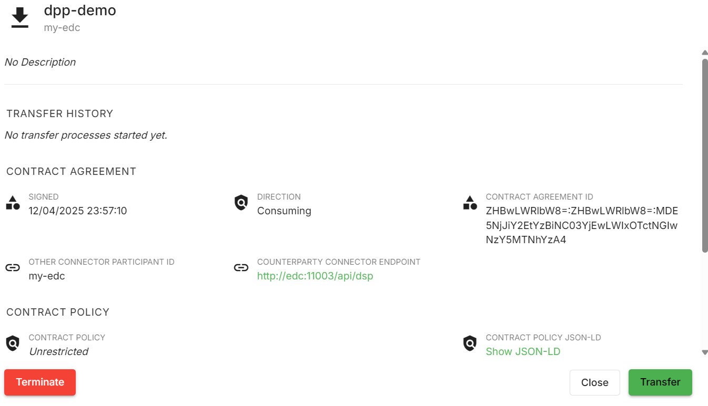

# Demo DATA4CIRC DPP

**NOTE This repository is for some experiments!**

This documentation demonstrates the integration of a DPP minimal application with the dataspaces concept.

## Introduction

The demonstration consists of the following components:

- DPP Backend Services
- DPP Frontend Application
- Dataspace Components

## Prerequisites

To run the application locally, you will need:

- Java 17
- Docker
- Node.js
- Git client

## Run the DPP Backend

To run the backend:

1. Navigate to the `/demo-dpp-backend` folder and execute the command: `docker compose up`

This will launch a Java Spring Boot application along with a PostgreSQL container.

To verify that the application is running, open a browser or use curl to access `http://localhost:8081/api/dpp`. This will return a list of all DPP records. **Note:** This is a demonstration application, and pagination and filtering functionalities have not yet been implemented. You can also fetch a specific record using a query parameter, e.g., `http://localhost:8081/api/dpp/detail?id=1`.

### Accessing API Documentation (Swagger UI)

The backend includes Swagger UI for exploring and testing the API endpoints. Once the backend is running, you can access the Swagger UI at:

`http://localhost:8081/swagger-ui/index.html`

This interface provides detailed information about each API endpoint, including request parameters, response structures, and allows you to send test requests directly from the browser.

## Run the DPP Frontend

To run the frontend:

1. Navigate to the `/demo-dpp-frontend` directory
2. Execute: `npm install` followed by `npm run`

This will launch a development server, and the web application will be accessible at `http://localhost:3000`

From the DPP frontend, you can add DPP records and create repair records.

## Run Dataspace Connectors

To run the dataspace:

1. Clone the Sovity EDC-CE repository into a separate folder

2. Follow the "Getting Started" guide for local development to initiate two connectors (this will include two EDC connectors with their corresponding UI dashboards)

Each connector interface will be available according to the guide as shown below:

|                     | First Connector                                              | Second Connector                                             |
| ------------------- | ------------------------------------------------------------ | ------------------------------------------------------------ |
| Homepage            | http://localhost:11000                                       | http://localhost:22000                                       |
| Management Endpoint | http://localhost:11002/api/management                        | http://localhost:22002/api/management                        |
| Management API Key  | ApiKeyDefaultValue                                           | ApiKeyDefaultValue                                           |
| Connector Endpoint  | http://edc:11003/api/dsp   Requires Docker Compose Network | http://edc2:11003/api/dsp   Requires Docker Compose Network |

## Create a Data Offer

For this demonstration, we will consider the first connector to be a provider organization that exposes or grants access to DPP data, and the second connector to be a consumer who will gain access to and receive DPP records.

1. Open the first connector UI at http://localhost:11000
2. Create a data offer according to the screenshots below:

Select data offer.
 

Introduce API endpoing representing source of the data. 

 

Add rest of details.

 

Publish data.

 

Check the data offer.

At this point, we have successfully created a new data offer. We now need to proceed to the consumer connector to negotiate access and establish a contract to access and transfer data.

## Negotiate a Contract

1. Open the second connector UI at http://localhost:22000
2. Negotiate a contract to access data from the first connector
3. Navigate to the Catalog Browser to verify the offer is available

Browse the catalog and select provider offer.

 

Open the offer and select the "Negotiate" button.

 

Confirm the negotiation.

 

Wait for negotiation to finish.

## Execute a Data Transfer

From the consumer connector select negotiated contract.

 

Select the contract and click on the "Transfer" button.

 

Add the transfer details. Most important is the destination URL, which should be the backend service URL called during the transfer process. 

 

Check status of the transfer.

For demonstration purposes, the result of the actual transfer is saved in a `log.txt` file in the backend service:

 

 
